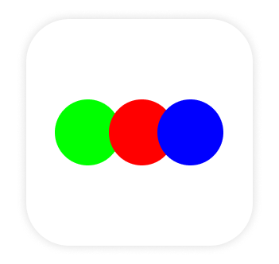
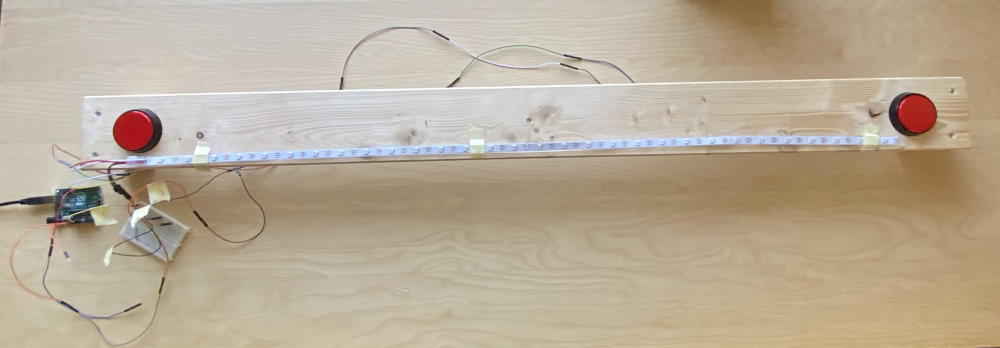

 

  

  <h3 align="center">LED Pong</h3>

  

    LED Pong is a simple two player game build with Arduino UNO R3.
     
    <a href="https://github.com/mrzmyr/led-pong/issues">Report Bug</a>
    ·
    <a href="https://github.com/mrzmyr/led-pong/issues">Request Feature</a>
  

## About The Project

  

  

This app was written to learn some c++ and how an Ardunio can be used to create a game.

**Material used:**

- 1x [Arduino UNO R3](https://store.arduino.cc/products/arduino-uno-rev3)
- 1x [USB 2.0 Cable Type A/B](https://store-usa.arduino.cc/products/usb-2-0-cable-type-a-b)
- 1x [WS2812B White PCB, 5m 30 IP67](https://www.aliexpress.com/item/2036819167.html?spm=a2g0o.order_detail.0.0.4d2f4c7fktNG4W)
- 2x [Large Arcade Button, 60mm](https://www.berrybase.de/bauelemente/schalter-taster/drucktaster/large-arcade-button-60mm-beleuchtet-40-led-12v-dc-41?c=81)
- 1x [LogiLink PA0257R 10000mAh Lithium Polymer Power Bank](https://www.amazon.de/gp/product/B08S78HKW4/ref=ppx_yo_dt_b_asin_image_o00_s00?ie=UTF8&psc=1)
- 1x [Screw Shield for Arduino](https://www.dold-mechatronik.de/Screw-Shield-for-Arduino)
- 1x [Toggle Switch](https://www.amazon.de/gp/product/B083NLCDQG/ref=ppx_yo_dt_b_asin_title_o02_s00?ie=UTF8&psc=1)
- 8x [Spade Cable connectors](https://www.amazon.de/gp/product/B084VKX2BP/ref=ppx_yo_dt_b_asin_title_o01_s00?ie=UTF8&psc=1)
- 1x wood plate (120 x 10 x 1 cm)
- 2x wood feet (10 x 5 x 4 cm)
- 4x screws
- Tape
- Wires

**Libraries used:**

- [FastLED](https://github.com/FastLED/FastLED)
- [LinkedList](https://github.com/ivanseidel/LinkedList)

## Contact

- mrzmyr [@mrzmyr](https://twitter.com/mrzmyr)
- Project Link: [https://github.com/mrzmyr/led-pong](https://github.com/mrzmyr/led-pong)
